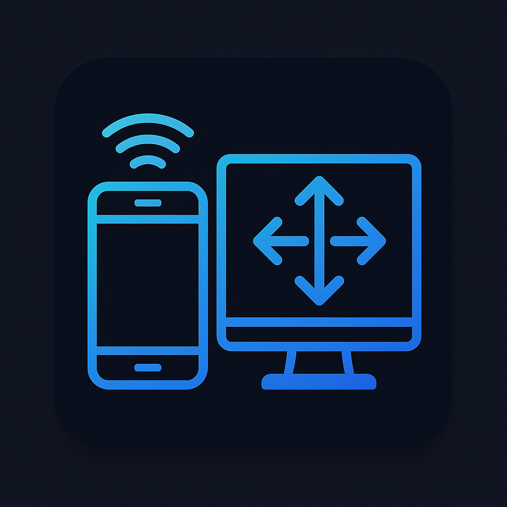

# RemoteReach

A wireless touchpad and keyboard controller that allows you to control your computer from your phone or any device with a web browser.

## Features

- **Wireless Control**: Control your computer remotely from any device on the same network
- **Touch Trackpad**: Smooth cursor movement with adjustable sensitivity, acceleration, and deadzone settings
- **Mouse Actions**: Left click, right click, double click, and scrolling
- **Virtual Keyboard**: Type text and use keyboard shortcuts
- **Responsive Design**: Works on phones, tablets, and other touch devices
- **Cross-Platform**: Compatible with Windows, macOS, and Linux

## Screenshots



## Installation

### Prerequisites

- **Python 3.7 or higher** - [Download Python](https://www.python.org/downloads/)
- **pip** (Python package installer) - Usually comes with Python

### Step-by-Step Installation

1. **Download or Clone the Project**:
   ```bash
   git clone <repository-url>
   cd RemoteReach
   ```

2. **Install Python Dependencies**:
   ```bash
   pip install -r requirements.txt
   ```
   
   **Alternative installation** (if you prefer to install packages individually):
   ```bash
   pip install Flask==3.0.0 Flask-SocketIO==5.3.6 PyAutoGUI==0.9.54 Pillow==10.1.0 numpy==1.24.3 eventlet==0.33.3 python-socketio==5.9.0
   ```

3. **Verify Installation**:
   ```bash
   python -c "import flask, flask_socketio, pyautogui; print('All dependencies installed successfully!')"
   ```

### Platform-Specific Setup

#### Windows
- No additional setup required
- Windows Defender may prompt for permissions when first running

#### macOS
- Grant accessibility permissions to Terminal or Python in **System Preferences → Security & Privacy → Privacy → Accessibility**
- You may need to allow the application through macOS security settings

#### Linux
- Install additional GUI automation dependencies:
  ```bash
  sudo apt-get install python3-tk python3-dev
  # For Ubuntu/Debian
  sudo apt-get install scrot python3-xlib
  ```

## Usage

### Quick Start

1. **Start the Server**:
   ```bash
   python app.py
   ```

   To use a custom host or port:
   ```bash
   python app.py --port 5000 --host 127.0.0.1
   ```

   The same can be configured with environment variables:
   ```bash
   PORT=5000 HOST=127.0.0.1 python app.py
   ```
   
   The server will automatically:
   - Find an available port (starting from 8080)
   - Display connection information
   - Show your local IP address for remote connections

2. **Connect from Your Device**:
   - **Same Computer**: Open browser to `http://localhost:8080` (or the displayed port)
   - **Remote Device**: Use the IP address shown (e.g., `http://192.168.1.100:8080`)
   - **Mobile/Tablet**: Simply navigate to the URL in any web browser

3. **Control Your Computer**:
   - **Mouse Movement**: Use the large trackpad area to move the cursor
   - **Clicking**: Tap the Left/Right/Double click buttons
   - **Scrolling**: Use the scroll area with up/down gestures
   - **Typing**: Use the virtual keyboard or type in the text input field
   - **Settings**: Adjust sensitivity, acceleration, smoothing, and deadzone in real-time

### Advanced Usage

#### Keyboard Shortcuts
The virtual keyboard supports common shortcuts:
- **Ctrl+C**, **Ctrl+V**, **Ctrl+Z** (Copy, Paste, Undo)
- **Alt+Tab** (Window switching)
- **Ctrl+Alt+Del** (Windows task manager)
- **Cmd+Space** (macOS Spotlight search)

#### Settings Explanation
- **Sensitivity**: How fast the cursor moves (1-10 scale)
- **Acceleration**: Increases speed for larger movements (0-10 scale)
- **Smoothing**: Reduces cursor jitter (1-10 scale)  
- **Deadzone**: Minimum movement threshold to prevent drift (0-10 scale)

#### Network Configuration
- The app automatically detects your local IP address
- Works on any network where devices can communicate
- Default port is 8080, but will auto-increment if busy
- No internet connection required - works on local networks

## Configuration

The application includes several customizable settings:

- **Sensitivity**: Adjusts how fast the cursor moves
- **Acceleration**: Increases movement speed for larger gestures
- **Smoothing**: Reduces jitter in cursor movement
- **Deadzone**: Minimum movement threshold to prevent accidental cursor drift

## Technical Details

- **Backend**: Flask with Socket.IO for real-time communication
- **Frontend**: HTML5 with JavaScript for touch events
- **Mouse Control**: PyAutoGUI for system-level mouse and keyboard control
- **Network**: Automatically finds available ports and displays connection info

## Security Note

This application allows remote control of your computer. Please observe these security guidelines:

- **Network Security**: Only use on trusted networks
- **Firewall**: Ensure your firewall settings are appropriate for your security needs
- **Secret Key**: For production use, set a custom SECRET_KEY environment variable:
  ```bash
  export SECRET_KEY="your-secure-random-key-here"
  python app.py
  ```
- **Access Control**: The application doesn't include authentication - consider network-level access controls if needed

## Troubleshooting

### Common Issues

1. **"Permission denied" on macOS/Linux**: You may need to grant accessibility permissions to Terminal or Python
2. **Firewall blocking connections**: Ensure your firewall allows incoming connections on the port being used
3. **PyAutoGUI not working**: Install the required dependencies for your operating system

### Platform-Specific Notes

- **macOS**: May require granting accessibility permissions in System Preferences
- **Linux**: May need additional packages for GUI automation
- **Windows**: Should work out of the box with the required Python packages

## Contributing

1. Fork the repository
2. Create a feature branch
3. Make your changes
4. Test thoroughly
5. Submit a pull request

## License

This project is licensed under the MIT License - see the [LICENSE](LICENSE) file for details.

## Acknowledgments

- Built with Flask and Socket.IO
- Uses PyAutoGUI for system control
- Inspired by modern touchpad interfaces
